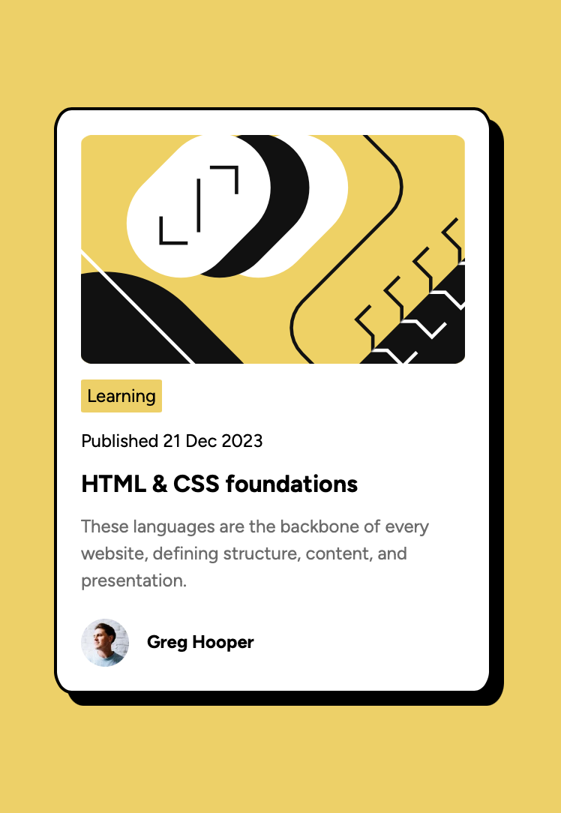
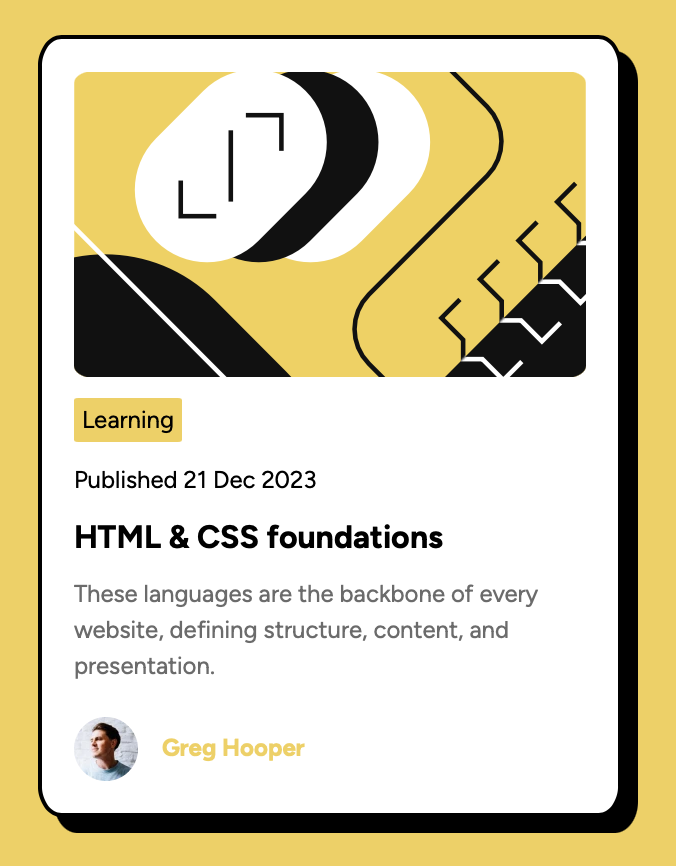
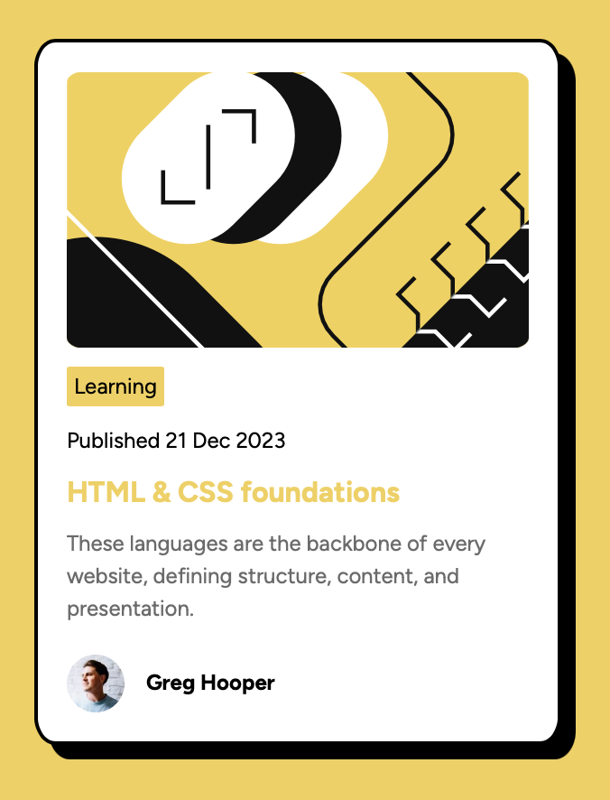

# Frontend Mentor - Blog preview card solution

This is a solution to the [Blog preview card challenge on Frontend Mentor](https://www.frontendmentor.io/challenges/blog-preview-card-ckPaj01IcS). Frontend Mentor challenges help you improve your coding skills by building realistic projects. 

## Table of contents

- [Overview](#overview)
  - [The challenge](#the-challenge)
  - [Screenshot](#screenshot)
  - [Links](#links)
- [My process](#my-process)
  - [Built with](#built-with)
  - [What I learned](#what-i-learned)
  - [Continued development](#continued-development)
  - [Useful resources](#useful-resources)
- [Author](#author)
- [Acknowledgments](#acknowledgments)

## Overview
This project builds a blog preview card with an:
- image
- blog title
- blog tag
- publish date
- blog tag
- blog blurb
- author image
- author name

This project is a challenge from frontend.io (https://www.frontendmentor.io/challenges/blog-preview-card-ckPaj01IcS). 

### The challenge

Users should be able to:
- See hover and focus states for all interactive elements on the page

### Screenshot

### Links

- Solution URL: [Add solution URL here](https://your-solution-url.com)
- Live Site URL: [Add live site URL here](https://your-live-site-url.com)

## My process
A slight improvement from my previous project to build a qr code reader card. With a firmer grasp on the box model and flex layouts I adjusted my apparoch this time:

1. Started by thinking about the boxes involved. I broke the build into:
  - blog preview card container
  - image
  - tag
  - publish date
  - heading
  - blurb
  - author (image + name)

2. Given that these elements are largely laid out vertically I decided to use a vertical flexbox layout.

3. Started designing outside and working in and downwards.

### Built with

- HTML5
- CSS3
- Flexbox

### What I learned

1. I think main learning has been reinforcing my learning from the QR code project of thinking in boxes, flexbox layouts and mobile responsive units.

2. Pseudo CSS Classes - this was the first time I've used psuedo classes to define the active sytle. Additionally also learnt about the cursor attribute.

3. If you want to finish writing you learnings, don't watch the F1 while writing it.

### Continued development
While I'm not there yet, I think it'd be interesting to see how this project works with pulling in dynamic content from a backend. Something for me to think about in the future.

### Useful resources

- [px to rem convertor](https://nekocalc.com/px-to-rem-converter) - This website helped me convert to rem units and helped with dynamic nature of the content.
- [flexbox cheat sheet](https://yoksel.github.io/flex-cheatsheet/#section-align-items-self) - As with my previous qr project, this was a very useful reference as I get to grips with thinking about flex layouts.

## Author

- Built By: Melvin Philip (Kuttan)
- Design Refrences: Frontend.io

## Acknowledgments

